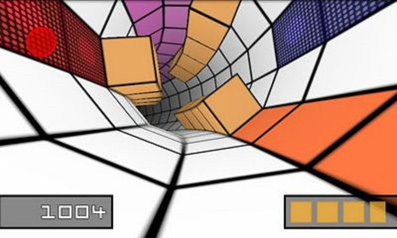

# Velocity — Game Specification

> A minimalist first-person tunnel racer for Android, inspired by SpeedX 3D.



---

## Table of Contents

1. [Game Overview & Inspiration](#1-game-overview--inspiration)
2. [Core Mechanics (Phase 1 — MVP)](#2-core-mechanics-phase-1--mvp)
3. [Visual Style](#3-visual-style)
4. [Controls & Input](#4-controls--input)
5. [Game Loop & Scoring](#5-game-loop--scoring)
6. [Performance Targets](#6-performance-targets)
7. [Future Features (Phase 2+)](#7-future-features-phase-2)
8. [Constraints & Assumptions](#8-constraints--assumptions)

---

## 1. Game Overview & Inspiration

**Velocity** is an Android-only, landscape-locked, first-person tunnel racing game. The player hurtles forward through an endless polygonal tunnel, dodging cube-shaped obstacles by tilting the device left and right. There is no visible spacecraft or vehicle — the camera *is* the player.

### Inspiration — SpeedX 3D

SpeedX 3D (2011, Android/iOS) is a minimalist tunnel racer with:

- A hexagonal/octagonal tunnel built from flat-shaded rectangles.
- Cube obstacles scattered along the tunnel floor.
- Tilt-based lateral movement that *looks* like the tunnel is rotating around the player.
- Gradually increasing speed and obstacle density.
- Simple wireframe / flat-color aesthetic.

Velocity recreates this core experience and extends it with a modular architecture designed for future gameplay evolution (see [§7](#7-future-features-phase-2)).

---

## 2. Core Mechanics (Phase 1 — MVP)

### 2.1 Tunnel

| Property | Detail |
|---|---|
| **Cross-section** | Regular polygon (e.g. octagon — 8 sides). Configurable at generation time. |
| **Construction** | Each "ring" is a polygon made of flat rectangles connecting consecutive rings. The tunnel is therefore a sequence of rectangular panels. |
| **Length** | Infinite — generated procedurally ahead of the camera and recycled behind it. |
| **Curvature** | The tunnel can curve (yaw/pitch) gradually. This is purely visual — the player does not need to steer through turns. The tunnel auto-aligns as it approaches. |
| **Color** | Single accent color for edges/panels against a dark (near-black) background. Panels may alternate shades for depth perception. |

### 2.2 Camera / Player

- The camera is always centered on the tunnel's forward axis.
- Forward speed is constant within a run (increases over time — see §2.5).
- The camera does **not** yaw or pitch in response to player input.
- The camera's **roll** is controlled by device tilt, creating the visual illusion of lateral movement inside the tunnel.
- Internally, the *player position* is tracked as an angular offset around the tunnel ring (e.g. 0°–360°). Rolling the tunnel visually is equivalent to shifting the player laterally.

### 2.3 Obstacles

| Property | Detail |
|---|---|
| **Shape** | Axis-aligned cubes (boxes). |
| **Placement** | Sitting on the inner surface of the tunnel wall (any panel). |
| **Distribution** | Randomly generated per segment with a difficulty-controlled density curve. |
| **Collision** | Touching an obstacle ends the run (single-hit death in MVP). |
| **Visual** | Solid flat-shaded color, contrasting with the tunnel panels. |

### 2.4 Lateral Movement Model

The player's lateral position is an **angular offset θ** around the tunnel cross-section.

- Tilting the device rolls the *world* (or equivalently shifts θ).
- θ is continuous — the player can wrap fully around the tunnel (360°).
- Movement speed (dθ/dt) is proportional to device tilt magnitude, clamped to a max rate.
- A small deadzone around neutral prevents drift.

This approach naturally extends to flattened/open-surface terrain in Phase 2 — θ just becomes a linear lateral offset when the cross-section opens up.

### 2.5 Difficulty Progression

| Time into run | Effect |
|---|---|
| 0 s – 30 s | Base speed, low obstacle density, wide gaps. |
| 30 s – 120 s | Speed ramps linearly, density increases, gap width decreases. |
| 120 s + | Speed and density plateau at a challenging but humanly playable maximum. |

Parameters are tunable constants, not hard-coded.

---

## 3. Visual Style

### 3.1 Aesthetic

- **Extremely minimalist.** Flat-shaded rectangles. No textures in MVP.
- Dark background (deep blue or black).
- Tunnel panels: single color with subtle shade variation per-face or alternating panels for depth.
- Obstacles: bright contrasting color (e.g. red cubes against blue/cyan tunnel).
- Optional: thin wireframe overlay on tunnel edges for that retro-grid look.

### 3.2 Camera & Perspective

- Standard perspective projection, ~60°–75° vertical FOV.
- Near clip ≈ 0.1, far clip set to draw distance (≈ 100–150 tunnel segments ahead).
- Fog/fade at the far end to hide popping.

### 3.3 Visual Effects (MVP-minimal)

- Speed lines or subtle radial blur at high speeds (stretch goal for MVP).
- Screen flash on collision / death.
- Simple fade-in on game start.

---

## 4. Controls & Input

### 4.1 Primary Control — Accelerometer Tilt

| Axis | Mapping |
|---|---|
| Device **roll** (rotation around the long/landscape axis) | Player lateral movement (tunnel rotation). |

- Input source: `SensorManager.SENSOR_ACCELEROMETER` or `TYPE_GAME_ROTATION_VECTOR`.
- Raw values are low-pass filtered to smooth jitter.
- Deadzone: ±0.5 m/s² around neutral.
- Sensitivity: configurable in settings.

### 4.2 Fallback — Touch Drag

For devices without reliable accelerometers (or emulator testing):

- Touch and drag left/right across the screen.
- Drag distance from center maps to tilt magnitude.

### 4.3 UI Controls

| Action | Input |
|---|---|
| Start game | Tap on title screen |
| Pause | Tap anywhere during gameplay (or Android back button) |
| Resume | Tap on pause overlay |
| Restart | Tap "Restart" button on death screen |
| Exit | Tap "Exit" button on title screen, pause screen, or death screen |

---

## 5. Game Loop & Scoring

### 5.1 State Machine

```
TITLE  →  PLAYING  →  DEAD  →  TITLE
              ↕
           PAUSED
```

### 5.2 Scoring

- **Primary metric:** Distance traveled (displayed as a running counter in arbitrary "meters").
- Distance increments proportionally to forward speed × dt each frame.
- **High score** persisted locally via `SharedPreferences` (or DataStore).
- Displayed on the death screen alongside the run's score.

### 5.3 HUD

| Element | Position | Detail |
|---|---|---|
| Distance counter | Top-center | Running score, large font. |
| Speed indicator | Top-right (optional) | Current speed as a multiplier (e.g. ×1.0, ×2.3). |
| High score | Death screen | Shown alongside run score. |

Minimal HUD — no health bar, no lives, no power-ups in MVP.

---

## 6. Performance Targets

| Metric | Target |
|---|---|
| Frame rate | Stable 60 fps on mid-range Android devices (2022+). |
| Min Android API | 26 (Android 8.0 Oreo). |
| RAM usage | < 100 MB. |
| APK size | < 15 MB (no textures, no audio assets in MVP). |
| Startup time | < 2 s to title screen. |
| Battery | Reasonable — no unnecessary wake-locks; pause rendering when backgrounded. |

---

## 7. Future Features (Phase 2+)

These are **not** in scope for Phase 1, but the architecture must be designed to accommodate them cleanly. See [architecture.md](architecture.md) §9 (Extensibility) for how each is supported.

### 7.1 Terrain Flattening

The tunnel cross-section can morph from a closed polygon to an open arch, a half-pipe, or a flat surface. The camera anchors to the connected rectangle panels and treats them as a ground surface. This is achieved by animating the vertex positions of the tunnel ring over time.

### 7.2 Sophisticated Obstacles

- **Animated obstacles:** cubes that translate side-to-side or rotate.
- **Non-box shapes:** wedges, ramps, cylinders.
- Each obstacle type is a subclass/component with its own update and mesh.

### 7.3 Jump / Fly Mechanic

- Tap to jump; player temporarily lifts off the surface.
- Requires vertical (radial) offset from the tunnel wall + gravity toward the surface.

### 7.4 Speed Effects

- Speed-up pads that boost forward velocity.
- Slow-down zones (e.g. "mud" panels).
- Visual feedback: FOV warp, motion blur intensity, color shift.

### 7.5 Pre-Created Maps

- Hand-authored tunnel segment sequences loaded from data files (JSON/binary).
- Fed into the same chunk-queue system used by the procedural generator.
- A `MapLoader` interface abstracts the source (procedural vs. file vs. network).

### 7.6 Lighting & Particles

- Per-vertex or per-fragment lighting with a single directional + ambient light.
- Particle emitter system for sparks, speed trails, explosion on death.

### 7.7 Sound & Music

- Ambient engine/wind loop that pitch-shifts with speed.
- Obstacle-near-miss "whoosh" sound.
- Collision impact sound.
- Background music track (electronic/synthwave).

### 7.8 Color & Textures

- Tunnel panels receive UV-mapped textures or procedural patterns.
- Obstacle materials with specular highlights.
- Theme system: swap color palettes / texture sets.

---

## 8. Constraints & Assumptions

| # | Constraint |
|---|---|
| C1 | Android-only. No iOS or desktop port in Phase 1. |
| C2 | Written in **Kotlin**. |
| C3 | Landscape orientation locked. |
| C4 | Single-player only. No networking. |
| C5 | No monetisation, ads, or IAP in MVP. |
| C6 | No third-party game engine in the recommended approach (raw OpenGL ES). |
| C7 | Must run without Google Play Services (no hard dependency). |

| # | Assumption |
|---|---|
| A1 | Target devices have a working accelerometer. Touch fallback provided. |
| A2 | OpenGL ES 2.0 is universally available on API 26+ devices. |
| A3 | No need for save/load of game state mid-run (runs are short). |
| A4 | Audio assets (Phase 2) will be small enough to bundle in APK. |

---

*Document version: 0.1 — Initial draft.*
*See also: [architecture.md](architecture.md)*

